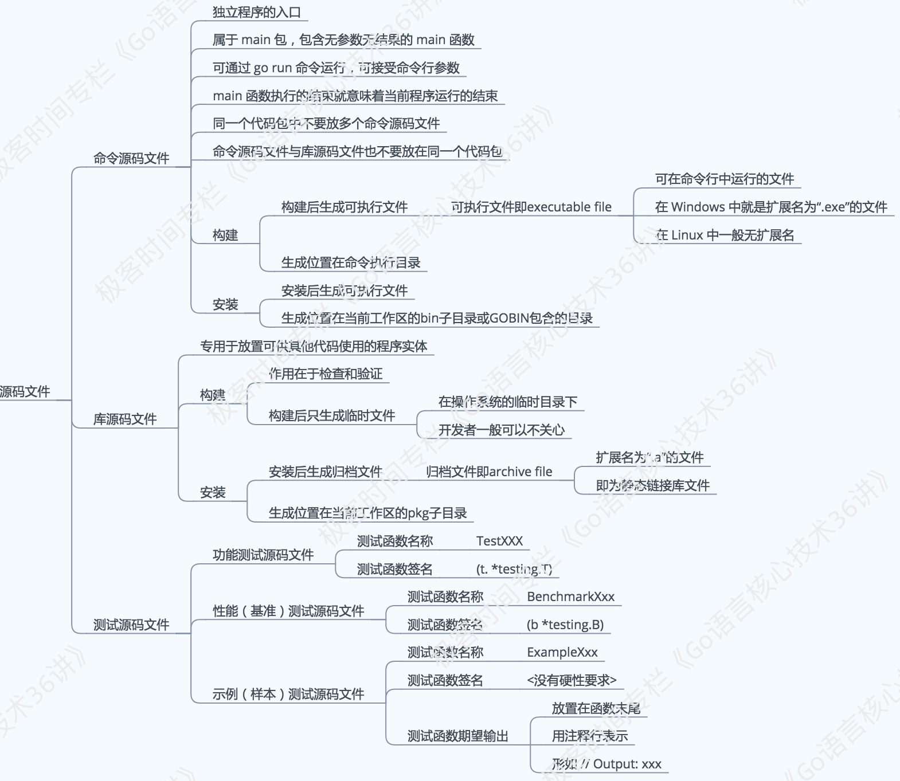

# 02 | 命令源码文件

我们已经知道，环境变量 GOPATH 指向的是`一个或多个工作区`，每个工作区中都会有以`代码包`为基本组织形式的源码文件。

这里的源码文件又分为三种，即：`命令源码文件`、`库源码文件`和`测试源码文件`，它们都有着不同的用途和编写规则。



对于 Go 语言学习者来说，你在学习阶段中，也一定会经常编写可以直接运行的程序。这样的程序肯定会涉及`命令源码文件`的编写，而且，命令源码文件也可以很方便地用 `go run` 命令启动。

那么，我今天的问题就是：命令源码文件的用途是什么，怎样编写它？

这里，我给出你一个参考的回答：命令源码文件是程序的运行入口，是每个可独立运行的程序必须拥有的。我们可以通过构建或安装，生成与其对应的可执行文件，后者一般会与该命令源码文件的直接父目录同名。

*如果一个源码文件声明属于 main 包，并且包含一个无参数声明且无结果声明的 main 函数，那么它就是命令源码文件*。 就像下面这段代码：

```golang
// demo1.go
package main

import "fmt"

func main() {
  fmt.Println("Hello, world!")
}
```

如果你把这段代码存成 demo1.go 文件，那么运行 

> go run demo1.go 

命令后就会在屏幕（标准输出）中看到
Hello, world!

当需要模块化编程时，我们往往会将代码拆分到多个文件，甚至拆分到不同的代码包中。但无论怎样，`对于一个独立的程序来说，命令源码文件永远只会也只能有一个`。
如果有与命令源码文件同包的源码文件，那么它们也应该声明属于 main 包。

## 知识精讲

1. 命令源码文件怎样接收参数

我们先看一段不完整的代码：

```golang
// demo2.go
package main

import (
  // 需在此处添加代码。[1]
  "fmt"
)

var name string

func init() {
  // 需在此处添加代码。[2]
}

func main() {
  // 需在此处添加代码。[3]
  fmt.Printf("Hello, %s!\n", name)
}
```

如果邀请你帮助我，在注释处添加相应的代码，并让程序实现”根据运行程序时给定的参数问候某人”的功能，你会打算怎样做？

首先，Go 语言标准库中有一个代码包专门用于接收和解析命令参数。这个代码包的名字叫 `flag`。

我之前说过，如果想要在代码中使用某个包中的程序实体，那么应该先导入这个包。因此，我们需要在[1]处添加代码"flag"。注意，这里应该在代码包导入路径的前后加上英文半角的引号。如此一来，上述代码导入了 flag 和 fmt 这两个包。

其次，人名肯定是由字符串代表的。所以我们要在[2]处添加调用 flag 包的 StringVar 函数的代码。就像这样：

```golang
flag.StringVar(&name, "name", "everyone", "The greeting object.")

```

函数flag.StringVar接受 4 个参数。

第 1 个参数是用于存储该命令参数值的地址，具体到这里就是在前面声明的变量 name 的地址了，由表达式 &name 表示。
第 2 个参数是为了指定该命令参数的名称，这里是 name。
第 3 个参数是为了指定在未追加该命令参数时的`默认值`，这里是 everyone。
至于第 4 个函数参数，即是该命令参数的简短说明了，这在打印命令说明时会用到。

顺便说一下，还有一个与 `flag.StringVar` 函数类似的函数，叫 `flag.String`。这两个函数的区别是，后者会直接返回一个已经分配好的用于存储命令参数值的地址。如果使用它的话，我们就需要把

var name string

改为

```goalng
var name = flag.String("name", "everyone", "The greeting object.")
```

所以，如果我们使用 flag.String 函数就需要改动原有的代码。这样并不符合上述问题的要求。

再说最后一个填空。我们需要在[3]处添加代码 flag.Parse()。函数 flag.Parse 用于真正解析命令参数，并把它们的值赋给相应的变量。

对该函数的调用必须在所有命令参数存储载体的声明（这里是对变量 name 的声明）和设置（这里是在[2]处对 flag.StringVar 函数的调用）之后，并且在读取任何命令参数值之前进行。

正因为如此，我们最好把 flag.Parse() 放在 main 函数的函数体的第一行。

2. 怎样在运行命令源码文件的时候传入参数，又怎样查看参数的使用说明

如果我们把上述代码存成名为 demo2.go 的文件，那么运行如下命令就可以为参数 name 传值：

> go run demo2.go -name="Robert"

运行后，打印到标准输出（stdout）的内容会是：

Hello, Robert!

另外，如果想查看该命令源码文件的参数说明，可以这样做：

> $ go run demo2.go --help

其中的$表示我们是在命令提示符后运行go run命令的。运行后输出的内容会类似：

```
Usage of /var/folders/ts/7lg_tl_x2gd_k1lm5g_48c7w0000gn/T/go-build155438482/b001/exe/demo2:
 -name string
    The greeting object. (default "everyone")
exit status 2
```

你可能不明白下面这段输出代码的意思。

/var/folders/ts/7lg_tl_x2gd_k1lm5g_48c7w0000gn/T/go-build155438482/b001/exe/demo2
这其实是go run命令构建上述命令源码文件时临时生成的可执行文件的完整路径。

如果我们先构建这个命令源码文件再运行生成的可执行文件，像这样：

$ go build demo2.go
$ ./demo2 --help

那么输出就会是

Usage of ./demo2:
 -name string
    The greeting object. (default "everyone")

3. 怎样自定义命令源码文件的参数使用说明

这有很多种方式，最简单的一种方式就是对变量flag.Usage重新赋值。flag.Usage 的类型是 func()，即一种无参数声明且无结果声明的函数类型。

flag.Usage 变量在声明时就已经被赋值了，所以我们才能够在运行命令 `go run demo2.go --help` 时看到正确的结果。

注意，对 flag.Usage 的赋值必须在调用 flag.Parse 函数之前。

现在，我们把 demo2.go 另存为 demo3.go，然后在main函数体的开始处加入如下代码。

```golang
flag.Usage = func() {
 fmt.Fprintf(os.Stderr, "Usage of %s:\n", "question")
 flag.PrintDefaults()
}
```

那么当运行

> $ go run demo3.go --help

后，就会看到

```
Usage of question:
 -name string
    The greeting object. (default "everyone")
exit status 2
```

现在再深入一层，我们在调用flag包中的一些函数（比如StringVar、Parse等等）的时候，实际上是在调用flag.CommandLine变量的对应方法。

flag.CommandLine相当于默认情况下的命令参数容器。所以，通过对flag.CommandLine重新赋值，我们可以更深层次地定制当前命令源码文件的参数使用说明。

现在我们把main函数体中的那条对flag.Usage变量的赋值语句注销掉，然后在init函数体的开始处添加如下代码：

```golang
flag.CommandLine = flag.NewFlagSet("", flag.ExitOnError)
flag.CommandLine.Usage = func() {
  fmt.Fprintf(os.Stderr, "Usage of %s:\n", "question")
  flag.PrintDefaults()
}
```

再运行命令 `go run demo3.go --help` 后，其输出会与上一次的输出的一致。不过后面这种定制的方法更加灵活。比如，当我们把为 flag.CommandLine 赋值的那条语句改为

flag.CommandLine = flag.NewFlagSet("", flag.PanicOnError)

后，再运行 go run demo3.go --help 命令就会产生另一种输出效果。这是由于我们在这里传给 flag.NewFlagSet 函数的第二个参数值是 flag.PanicOnError 。flag.PanicOnError 和 flag.ExitOnError 都是预定义在 flag 包中的常量。

flag.ExitOnError 的含义是，告诉命令参数容器，当命令后跟 --help 或者参数设置的不正确的时候，在打印命令参数使用说明后以状态码2结束当前程序。

状态码2代表用户错误地使用了命令，而 flag.PanicOnError 与之的区别是在最后抛出“运行时恐慌（panic）”。

上述两种情况都会在我们调用 flag.Parse 函数时被触发。顺便提一句，“运行时恐慌”是 Go 程序错误处理方面的概念。

下面再进一步，我们索性不用全局的 flag.CommandLine 变量，转而自己创建一个私有的命令参数容器。我们在函数外再添加一个变量声明：

var cmdLine = flag.NewFlagSet("question", flag.ExitOnError)

然后，我们把对 flag.StringVar 的调用替换为对 cmdLine.StringVar 调用，再把 flag.Parse() 替换为 cmdLine.Parse(os.Args[1:])。

其中的os.Args[1:]指的就是我们给定的那些命令参数。这样做就完全脱离了 flag.CommandLine。*flag.FlagSet 类型的变量 cmdLine 拥有很多有意思的方法。你可以去探索一下。

这样做的好处依然是更灵活地定制命令参数容器。但更重要的是，你的定制完全不会影响到那个全局变量flag.CommandLine。

## 总结

如果你想详细了解 flag 包的用法，可以到这个网址 https://golang.google.cn/pkg/flag/ 查看文档。或者直接使用 `godoc` 命令在本地启动一个 Go 语言文档服务器。怎样使用 godoc 命令？你可以参看这里 https://github.com/hyper0x/go_command_tutorial/blob/master/0.5.md。

## 思考题
我们已经见识过为命令源码文件传入字符串类型的参数值的方法，那还可以传入别的吗？

默认情况下，我们可以让命令源码文件接受哪些类型的参数值？
我们可以把自定义的数据类型作为参数值的类型吗？如果可以，怎样做？

## 课程链接

http://gk.link/a/10AqZ

## [知识共享许可协议](http://creativecommons.org/licenses/by-nc-sa/4.0/)

本作品采用知识共享署名-非商业性使用-相同方式共享 4.0 国际许可协议进行许可。

欢迎转载、使用、重新发布，但务必保留文章署名 郑子铭 （包含链接： http://www.cnblogs.com/MingsonZheng/ ），不得用于商业目的，基于本文修改后的作品务必以相同的许可发布。

---

本文系转载文章，若要查看原文，请到 [http://www.cnblogs.com/MingsonZheng/](http://www.cnblogs.com/MingsonZheng/)
