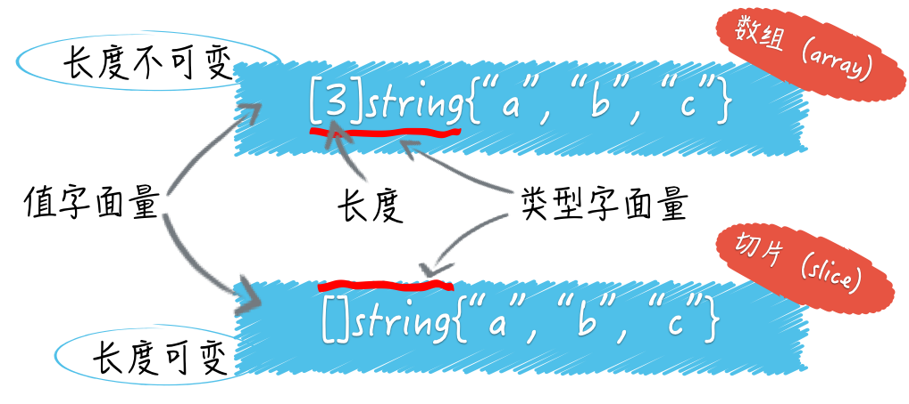
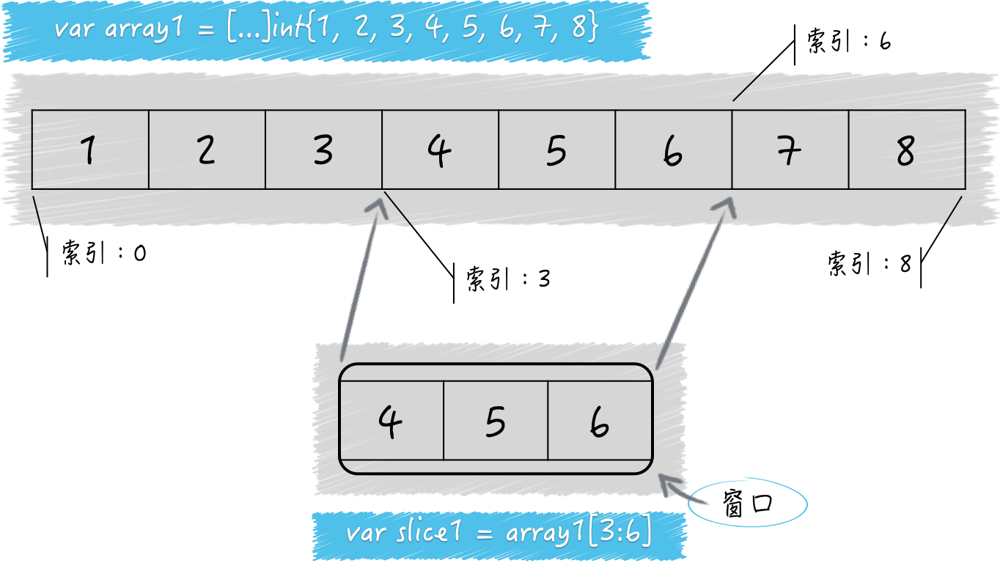

# 07 | 数组和切片

我们这次主要讨论 Go 语言的`数组（array）`类型和`切片（slice）`类型。

它们的共同点是都属于集合类的类型，并且，它们的值也都可以用来存储某一种类型的值（或者说元素）。

不过，它们最重要的不同是：数组类型的值（以下简称数组）的长度是固定的，而切片类型的值（以下简称切片）是可变长的。

数组的长度在声明它的时候就必须给定，并且之后不会再改变。可以说，数组的长度是其类型的一部分。比如 `[1]string` 和 `[2]string` 就是两个不同的数组类型。

而切片的类型字面量中只有元素的类型，而没有长度。切片的长度可以自动地随着其中元素数量的增长而增长，*但不会随着元素数量的减少而减小*。



我们其实可以把切片看做是对数组的一层简单的封装，因为在每个切片的底层数据结构中，一定会包含一个数组。数组可以被叫做切片的底层数组，而*切片也可以被看作是对数组的某个连续片段的*`引用`。

也正因为如此，Go 语言的`切片类型`属于`引用类型`，同属引用类型的还有`字典类型`、`通道类型`、`函数类型`等；而 Go 语言的`数组类型则`属于`值类型`，同属值类型的有`基础数据类型`以及`结构体类型`。

注意，Go 语言里不存在像 Java 等编程语言中令人困惑的“传值或传引用”问题。*在 Go 语言中，我们判断所谓的“传值”或者“传引用”只要看被传递的值的类型就好了*。

如果传递的值是引用类型的，那么就是“传引用”。如果传递的值是值类型的，那么就是“传值”。从传递成本的角度讲，引用类型的值往往要比值类型的值低很多。

我们在数组和切片之上都可以应用索引表达式，得到的都会是某个元素。我们在它们之上也都可以应用切片表达式，也都会得到一个新的切片。

我们通过调用`内建函数 len`，得到数组和切片的长度。通过调用`内建函数 cap`，我们可以得到它们的容量。

但要注意，数组的容量永远等于其长度，都是不可变的。切片的容量却不是这样，并且它的变化是有规律可寻的。

我们今天的问题就是：怎样正确估算切片的长度和容量？

为此，我编写了一个简单的命令源码文件 demo15.go。

```golang
package main

import "fmt"

func main() {
  // 示例1。
  s1 := make([]int, 5)
  fmt.Printf("The length of s1: %d\n", len(s1))
  fmt.Printf("The capacity of s1: %d\n", cap(s1))
  fmt.Printf("The value of s1: %d\n", s1)
  s2 := make([]int, 5, 8)
  fmt.Printf("The length of s2: %d\n", len(s2))
  fmt.Printf("The capacity of s2: %d\n", cap(s2))
  fmt.Printf("The value of s2: %d\n", s2)
}
```

首先，我用内建函数 `make` 声明了一个 `[]int` 类型的变量 s1。我传给 make 函数的第二个参数是 5，从而指明了该切片的长度。我用几乎同样的方式声明了切片 s2，只不过多传入了一个参数 8 以指明该切片的容量。

现在，具体的问题是：切片 s1 和 s2 的容量都是多少？

这道题的典型回答：切片 s1 和 s2 的容量分别是 5 和 8。

问题解析

解析一下这道题。s1的容量为什么是 5 呢？因为我在声明 s1 的时候把它的长度设置成了 5。当我们用 make 函数初始化切片时，如果不指明其容量，那么它就会和长度一致。如果在初始化时指明了容量，那么切片的实际容量也就是它了。这也正是 s2 的容量是 8 的原因。

我们顺便通过 s2 再来明确下长度、容量以及它们的关系。我在初始化 s2 代表的切片时，同时也指定了它的长度和容量。

我在刚才说过，可以把切片看做是对数组的一层简单的封装，因为在每个切片的底层数据结构中，一定会包含一个数组。数组可以被叫做切片的底层数组，而切片也可以被看作是对数组的某个连续片段的引用。

在这种情况下，切片的容量实际上代表了它的底层数组的长度，这里是 8。（注意，切片的底层数组等同于我们前面讲到的数组，其长度不可变。）

现在你需要跟着我一起想象：有一个窗口，你可以通过这个窗口看到一个数组，但是不一定能看到该数组中的所有元素，有时候只能看到连续的一部分元素。

现在，这个数组就是切片 s2 的底层数组，而这个窗口就是切片 s2 本身。s2 的长度实际上指明的就是这个窗口的宽度，决定了你透过 s2，可以看到其底层数组中的哪几个连续的元素。

由于 s2 的长度是 5，所以你可以看到底层数组中的第 1 个元素到第 5 个元素，对应的底层数组的索引范围是 [0, 4]。

切片代表的窗口也会被划分成一个一个的小格子，就像我们家里的窗户那样。每个小格子都对应着其底层数组中的某一个元素。

我们继续拿 s2 为例，这个窗口最左边的那个小格子对应的正好是其底层数组中的第一个元素，即索引为 0 的那个元素。因此可以说，s2 中的索引从 0 到 4 所指向的元素恰恰就是其底层数组中索引从 0 到 4 代表的那 5 个元素。

请记住，当我们用 make 函数或切片值字面量（比如 []int{1, 2, 3} ）初始化一个切片时，该窗口最左边的那个小格子总是会对应其底层数组中的第 1 个元素。

但是当我们通过切片表达式基于某个数组或切片生成新切片的时候，情况就变得复杂起来了。

我们再来看一个例子：

```golang
s3 := []int{1, 2, 3, 4, 5, 6, 7, 8}
s4 := s3[3:6]
fmt.Printf("The length of s4: %d\n", len(s4))
fmt.Printf("The capacity of s4: %d\n", cap(s4))
fmt.Printf("The value of s4: %d\n", s4)
```

切片 s3 中有 8 个元素，分别是从 1 到 8 的整数。s3 的长度和容量都是 8。然后，我用切片表达式 s3[3:6] 初始化了切片 s4。问题是，这个 s4 的长度和容量分别是多少？

这并不难，用减法就可以搞定。首先你要知道，切片表达式中的方括号里的那两个整数都代表什么。我换一种表达方式你也许就清楚了，即：[3, 6)。

这是数学中的区间表示法，常用于表示取值范围，我其实已经在本专栏用过好几次了。由此可知，[3:6] 要表达的就是透过新窗口能看到的 s3 中元素的索引范围是从 3 到 5（注意，不包括6）。

这里的 3 可被称为起始索引，6 可被称为结束索引。那么 s4 的长度就是 6 减去 3，即 3。因此可以说，s4 中的索引从 0 到 2 指向的元素对应的是 s3 及其底层数组中索引从 3 到 5 的那 3 个元素。



再来看容量。我在前面说过，切片的容量代表了它的底层数组的长度，但这仅限于使用 make 函数或者切片值字面量初始化切片的情况。

更通用的规则是：一个切片的容量可以被看作是透过这个窗口最多可以看到的底层数组中元素的个数。

由于s4是通过在s3上施加切片操作得来的，所以s3的底层数组就是s4的底层数组。

又因为，在底层数组不变的情况下，切片代表的窗口可以向右扩展，直至其底层数组的末尾。

所以，s4的容量就是其底层数组的长度8, 减去上述切片表达式中的那个起始索引3，即5。

注意，切片代表的窗口是无法向左扩展的。也就是说，我们永远无法透过s4看到s3中最左边的那 3 个元素。

最后，顺便提一下把切片的窗口向右扩展到最大的方法。对于s4来说，切片表达式 s4[0:cap(s4)] 就可以做到。我想你应该能看懂。该表达式的结果值（即一个新的切片）会是[]int{4, 5, 6, 7, 8}，其长度和容量都是5。

## 知识扩展

### 问题 1：怎样估算切片容量的增长？

一旦一个切片无法容纳更多的元素，Go 语言就会想办法扩容。但它并不会改变原来的切片，而是会生成一个容量更大的切片，然后将把原有的元素和新元素一并拷贝到新切片中。在一般的情况下，你可以简单地认为新切片的容量（以下简称新容量）将会是原切片容量（以下简称原容量）的 2 倍。

但是，当原切片的长度（以下简称原长度）大于或等于1024时，Go 语言将会以原容量的1.25倍作为新容量的基准（以下新容量基准）。新容量基准会被调整（不断地与1.25相乘），直到结果不小于原长度与要追加的元素数量之和（以下简称新长度）。最终，新容量往往会比新长度大一些，当然，相等也是可能的。

另外，如果我们一次追加的元素过多，以至于使新长度比原容量的 2 倍还要大，那么新容量就会以新长度为基准。注意，与前面那种情况一样，最终的新容量在很多时候都要比新容量基准更大一些。
更多细节*可参见 runtime 包中 slice.go 文件里的 growslice 及相关函数的具体实现*。

我把展示上述扩容策略的一些例子都放到了 demo16.go 文件中。你可以去试运行看看。

```golang
package main

import "fmt"

func main() {
	// 示例1。
	s6 := make([]int, 0)
	fmt.Printf("The capacity of s6: %d\n", cap(s6))
	for i := 1; i <= 5; i++ {
		s6 = append(s6, i)
		fmt.Printf("s6(%d): len: %d, cap: %d\n", i, len(s6), cap(s6))
	}
	fmt.Println()

	// 示例2。
	s7 := make([]int, 1024)
	fmt.Printf("The capacity of s7: %d\n", cap(s7))
	s7e1 := append(s7, make([]int, 200)...)
	fmt.Printf("s7e1: len: %d, cap: %d\n", len(s7e1), cap(s7e1))
	s7e2 := append(s7, make([]int, 400)...)
	fmt.Printf("s7e2: len: %d, cap: %d\n", len(s7e2), cap(s7e2))
	s7e3 := append(s7, make([]int, 600)...)
	fmt.Printf("s7e3: len: %d, cap: %d\n", len(s7e3), cap(s7e3))
	fmt.Println()

	// 示例3。
	s8 := make([]int, 10)
	fmt.Printf("The capacity of s8: %d\n", cap(s8))
	s8a := append(s8, make([]int, 11)...)
	fmt.Printf("s8a: len: %d, cap: %d\n", len(s8a), cap(s8a))
	s8b := append(s8a, make([]int, 23)...)
	fmt.Printf("s8b: len: %d, cap: %d\n", len(s8b), cap(s8b))
	s8c := append(s8b, make([]int, 45)...)
	fmt.Printf("s8c: len: %d, cap: %d\n", len(s8c), cap(s8c))
}
```

### 问题 2：切片的底层数组什么时候会被替换？

确切地说，一个切片的底层数组永远不会被替换。为什么？虽然在扩容的时候 Go 语言一定会生成新的底层数组，但是它也同时生成了新的切片。

它只是把新的切片作为了新底层数组的窗口，而没有对原切片，及其底层数组做任何改动。

请记住，在无需扩容时，append函数返回的是指向原底层数组的原切片，而在需要扩容时，append函数返回的是指向新底层数组的新切片。所以，严格来讲，“扩容”这个词用在这里虽然形象但并不合适。不过鉴于这种称呼已经用得很广泛了，我们也没必要另找新词了。

顺便说一下，只要新长度不会超过切片的原容量，那么使用append函数对其追加元素的时候就不会引起扩容。这只会使紧邻切片窗口右边的（底层数组中的）元素被新的元素替换掉。你可以运行 demo17.go 文件以增强对这些知识的理解。

```golang
package main

import "fmt"

func main() {
	// 示例1。
	a1 := [7]int{1, 2, 3, 4, 5, 6, 7}
	fmt.Printf("a1: %v (len: %d, cap: %d)\n",
		a1, len(a1), cap(a1))
	s9 := a1[1:4]
	//s9[0] = 1
	fmt.Printf("s9: %v (len: %d, cap: %d)\n",
		s9, len(s9), cap(s9))
	for i := 1; i <= 5; i++ {
		s9 = append(s9, i)
		fmt.Printf("s9(%d): %v (len: %d, cap: %d)\n",
			i, s9, len(s9), cap(s9))
	}
	fmt.Printf("a1: %v (len: %d, cap: %d)\n",
		a1, len(a1), cap(a1))
	fmt.Println()

}

```

## 总结

总结一下，我们今天一起探讨了数组和切片以及它们之间的关系。切片是基于数组的，可变长的，并且非常轻快。一个切片的容量总是固定的，而且一个切片也只会与某一个底层数组绑定在一起。

此外，切片的容量总会是在切片长度和底层数组长度之间的某一个值，并且还与切片窗口最左边对应的元素在底层数组中的位置有关系。那两个分别用减法计算切片长度和容量的方法你一定要记住

另外，如果新的长度比原有切片的容量还要大，那么底层数组就一定会是新的，而且append函数也会返回一个新的切片。还有，你其实不必太在意切片“扩容”策略中的一些细节，只要能够理解它的基本规律并可以进行近似的估算就可以了。

## 思考题

这里仍然是聚焦于切片的问题。

如果有多个切片指向了同一个底层数组，那么你认为应该注意些什么？
怎样沿用“扩容”的思想对切片进行“缩容”？请写出代码。

## 课程链接

http://gk.link/a/10AqZ

## [知识共享许可协议](http://creativecommons.org/licenses/by-nc-sa/4.0/)

本作品采用知识共享署名-非商业性使用-相同方式共享 4.0 国际许可协议进行许可。

欢迎转载、使用、重新发布，但务必保留文章署名 郑子铭 （包含链接： http://www.cnblogs.com/MingsonZheng/ ），不得用于商业目的，基于本文修改后的作品务必以相同的许可发布。

---

本文系转载文章，若要查看原文，请到 [http://www.cnblogs.com/MingsonZheng/](http://www.cnblogs.com/MingsonZheng/)
