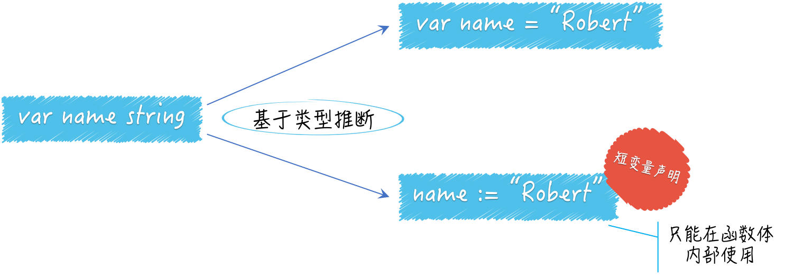

# 04 | 程序实体的那些事儿（上）

还记得吗？Go 语言中的程序实体包括`变量、常量、函数、结构体和接口`。 Go 语言是`静态`类型的编程语言，所以我们在声明变量或常量的时候，都需要指定它们的类型，或者给予足够的信息，这样才可以让 Go 语言能够推导出它们的类型。

## 问题：声明变量有几种方式？

```go
package main

import (
  "flag"
  "fmt"
)

func main() {
  var name string // [1]
  flag.StringVar(&name, "name", "everyone", "The greeting object.") // [2]
  flag.Parse()
  fmt.Printf("Hello, %v!\n", name)
}

```

这是一个很简单的命令源码文件，我把它命名为 demo7.go。它是 demo2.go 的微调版。我只是把变量name的声明和对flag.StringVar函数的调用，都移动到了main函数中，这分别对应代码中的注释[1]和[2]。

具体的问题是，除了var name string这种声明变量name的方式，还有其他方式吗？你可以选择性地改动注释[1]和[2]处的代码。

## 典型回答

第一种方式需要先对注释[2]处的代码稍作改动，把被调用的函数由flag.StringVar改为flag.String，传参的列表也需要随之修改，这是为了[1]和[2]处代码合并的准备工作。

```go
var name = flag.String("name", "everyone", "The greeting object.")

```

合并后的代码看起来更简洁一些。我把注释[1]处的代码中的string去掉了，右边添加了一个=，然后再拼接上经过修改的[2]处代码。

注意，flag.String函数返回的结果值的类型是string而不是string。类型string代表的是字符串的指针类型，而不是字符串类型。因此，这里的变量name代表的是一个指向字符串值的指针。

因此，在这种情况下，那个被用来打印内容的函数调用就需要微调一下，把其中的参数name改为*name，即：fmt.Printf("Hello, %v!\n", *name)。

第二种方式与第一种方式非常类似，它基于第一种方式的代码，赋值符号=右边的代码不动，左边只留下name，再把=变成:=。

```go
name := flag.String("name", "everyone", "The greeting object.")

```

## 问题解析

这个问题的基本考点有两个。一个是你要知道 Go 语言中的类型推断，以及它在代码中的基本体现，另一个是短变量声明的用法。

第一种方式中的代码在声明变量name的同时，还为它赋了值，而这时声明中并没有显式指定name的类型。

还记得吗？之前的变量声明语句是var name string。这里利用了 Go 语言自身的类型推断，而省去了对该变量的类型的声明。

你可以认为，表达式类型就是对表达式进行求值后得到结果的类型。Go 语言中的类型推断是很简约的，这也是 Go 语言整体的风格。

它只能用于对变量或常量的初始化，就像上述回答中描述的那样。对flag.String函数的调用其实就是一个调用表达式，而这个表达式的类型是*string，即字符串的指针类型。

至于第二种方式所用的短变量声明，实际上就是 Go 语言的类型推断再加上一点点语法糖。

我们只能在函数体内部使用短变量声明。在编写if、for或switch语句的时候，我们经常把它安插在初始化子句中，并用来声明一些临时的变量。而相比之下，第一种方式更加通用，它可以被用在任何地方。



## 知识扩展

1. Go 语言的类型推断可以带来哪些好处？

当然，在写代码时，我们通过使用 Go 语言的类型推断，而节省下来的键盘敲击次数几乎可以忽略不计。但它真正的好处，往往会体现在我们写代码之后的那些事情上，比如代码重构。

为了更好的演示，我们先要做一点准备工作。我们依然通过调用一个函数在声明name变量的同时为它赋值，但是这个函数不是flag.String，而是由我们自己定义的某个函数，比如叫getTheFlag。

```go
package main

import (
  "flag"
  "fmt"
)

func main() {
  var name = getTheFlag()
  flag.Parse()
  fmt.Printf("Hello, %v!\n", *name)
}

func getTheFlag() *string {
  return flag.String("name", "everyone", "The greeting object.")
}

```

我们可以用getTheFlag函数包裹（或者说包装）那个对flag.String函数的调用，并把其结果直接作为getTheFlag函数的结果，结果的类型是*string。

这样一来，var name =右边的表达式，可以变为针对getTheFlag函数的调用表达式了。这实际上是对“声明并赋值name变量的那行代码”的重构。

我们通常把不改变某个程序与外界的任何交互方式和规则，而只改变其内部实现”的代码修改方式，叫做对该程序的重构。重构的对象可以是一行代码、一个函数、一个功能模块，甚至一个软件系统。

好了，在准备工作做完之后，你会发现，你可以随意改变getTheFlag函数的内部实现，及其返回结果的类型，而不用修改main函数中的任何代码。

这个命令源码文件依然可以通过编译，并且构建和运行也都不会有问题。也许你能感觉得到，这是一个关于程序灵活性的质变。

我们不显式地指定变量name的类型，使得它可以被赋予任何类型的值。也就是说，变量name的类型可以在其初始化时，由其他程序动态地确定。

在你改变getTheFlag函数的结果类型之后，Go 语言的编译器会在你再次构建该程序的时候，自动地更新变量name的类型。如果你使用过Python或Ruby这种动态类型的编程语言的话，一定会觉得这情景似曾相识。

没错，通过这种类型推断，你可以体验到动态类型编程语言所带来的一部分优势，即程序灵活性的明显提升。但在那些编程语言中，这种提升可以说是用程序的可维护性和运行效率换来的。

Go 语言是静态类型的，所以一旦在初始化变量时确定了它的类型，之后就不可能再改变。这就避免了在后面维护程序时的一些问题。另外，请记住，这种类型的确定是在编译期完成的，因此不会对程序的运行效率产生任何影响。

现在，你应该已经对这个问题有一个比较深刻的理解了。

如果只用一两句话回答这个问题的话，我想可以是这样的：Go 语言的类型推断可以明显提升程序的灵活性，使得代码重构变得更加容易，同时又不会给代码的维护带来额外负担（实际上，它恰恰可以避免散弹式的代码修改），更不会损失程序的运行效率。

2. 变量的重声明是什么意思？

这涉及了短变量声明。通过使用它，我们可以对同一个代码块中的变量进行重声明。

既然说到了代码块，我先来解释一下它。在 Go 语言中，代码块一般就是一个由花括号括起来的区域，里面可以包含表达式和语句。Go 语言本身以及我们编写的代码共同形成了一个非常大的代码块，也叫全域代码块。

回到变量重声明的问题上。其含义是对已经声明过的变量再次声明。变量重声明的前提条件如下。

- 由于变量的类型在其初始化时就已经确定了，所以对它再次声明时赋予的类型必须与其原本的类型相同，否则会产生编译错误。
- 变量的重声明只可能发生在某一个代码块中。如果与当前的变量重名的是外层代码块中的变量，那么就是另外一种含义了。
- 变量的重声明只有在使用短变量声明时才会发生，否则也无法通过编译。如果要在此处声明全新的变量，那么就应该使用包含关键字var的声明语句，但是这时就不能与同一个代码块中的任何变量有重名了。
- 被“声明并赋值”的变量必须是多个，并且其中至少有一个是新的变量。这时我们才可以说对其中的旧变量进行了重声明。

这样来看，变量重声明其实算是一个语法糖（或者叫便利措施）。它允许我们在使用短变量声明时不用理会被赋值的多个变量中是否包含旧变量。可以想象，如果不这样会多写不少代码。

我把一个简单的例子写在了“Golang_Puzzlers”项目的puzzlers/article4/q3包中的 demo9.go 文件中，你可以去看一下。

这其中最重要的两行代码如下：


```go
var err error
n, err := io.WriteString(os.Stdout, "Hello, everyone!\n")
```

我使用短变量声明对新变量n和旧变量err进行了“声明并赋值”，这时也是对后者的重声明。

## 总结

在本篇中，我们聚焦于最基本的 Go 语言程序实体：变量。并详细解说了变量声明和赋值的基本方法，及其背后的重要概念和知识。我们使用关键字var和短变量声明，都可以实现对变量的“声明并赋值”。

这两种方式各有千秋，有着各自的特点和适用场景。前者可以被用在任何地方，而后者只能被用在函数或者其他更小的代码块中。

不过，通过前者我们无法对已有的变量进行重声明，也就是说它无法处理新旧变量混在一起的情况。不过它们也有一个很重要的共同点，即：基于类型推断，Go 语言的类型推断只应用在了对变量或常量的初始化方面。

## 思考题

如果与当前的变量重名的是外层代码块中的变量，那么这意味着什么？

## 课程链接

http://gk.link/a/10AqZ

## [知识共享许可协议](http://creativecommons.org/licenses/by-nc-sa/4.0/)

本作品采用知识共享署名-非商业性使用-相同方式共享 4.0 国际许可协议进行许可。

欢迎转载、使用、重新发布，但务必保留文章署名 郑子铭 （包含链接： http://www.cnblogs.com/MingsonZheng/ ），不得用于商业目的，基于本文修改后的作品务必以相同的许可发布。

---

本文系转载文章，若要查看原文，请到 [http://www.cnblogs.com/MingsonZheng/](http://www.cnblogs.com/MingsonZheng/)