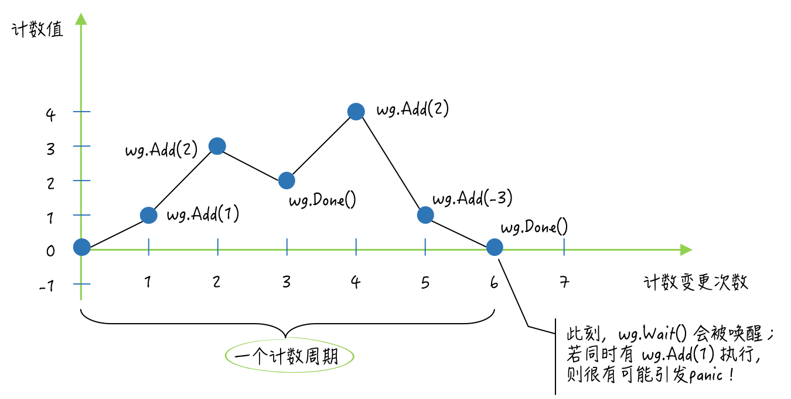

# 31 | sync.WaitGroup和sync.Once
我们在前几次讲的互斥锁、条件变量和原子操作都是最基本重要的同步工具。在 Go 语言中，除了通道之外，它们也算是最为常用的并发安全工具了。

说到通道，不知道你想过没有，之前在一些场合下里，我们使用通道的方式看起来都似乎有些蹩脚。

比如：声明一个通道，使它的容量与我们手动启用的 goroutine 的数量相同，之后再利用这个通道，让主 goroutine 等待其他 goroutine 的运行结束。

这一步更具体地说就是：让其他的 goroutine 在运行结束之前，都向这个通道发送一个元素值，并且，让主 goroutine 在最后从这个通道中接收元素值，接收的次数需要与其他的 goroutine 的数量相同。

这就是下面的coordinateWithChan函数展示的多 goroutine 协作流程。
```go
func coordinateWithChan() {
 sign := make(chan struct{}, 2)
 num := int32(0)
 fmt.Printf("The number: %d [with chan struct{}]\n", num)
 max := int32(10)
 go addNum(&num, 1, max, func() {
  sign <- struct{}{}
 })
 go addNum(&num, 2, max, func() {
  sign <- struct{}{}
 })
 <-sign
 <-sign
}
```
其中的addNum函数的声明在 demo65.go 文件中。addNum函数会把它接受的最后一个参数值作为其中的defer函数。

我手动启用的两个 goroutine 都会调用addNum函数，而它们传给该函数的最后一个参数值（也就是那个既无参数声明，也无结果声明的函数）都只会做一件事情，那就是向通道sign发送一个元素值。

看到coordinateWithChan函数中最后的那两行代码了吗？重复的两个接收表达式<-sign，是不是看起来很丑陋？

前导内容：sync包的WaitGroup类型
其实，在这种应用场景下，我们可以选用另外一个同步工具，即：sync包的WaitGroup类型。它比通道更加适合实现这种一对多的 goroutine 协作流程。

sync.WaitGroup类型（以下简称WaitGroup类型）是开箱即用的，也是并发安全的。同时，与我们前面讨论的几个同步工具一样，它一旦被真正使用就不能被复制了。

WaitGroup类型拥有三个指针方法：Add、Done和Wait。你可以想象该类型中有一个计数器，它的默认值是0。我们可以通过调用该类型值的Add方法来增加，或者减少这个计数器的值。

一般情况下，我会用这个方法来记录需要等待的 goroutine 的数量。相对应的，这个类型的Done方法，用于对其所属值中计数器的值进行减一操作。我们可以在需要等待的 goroutine 中，通过defer语句调用它。

而此类型的Wait方法的功能是，阻塞当前的 goroutine，直到其所属值中的计数器归零。如果在该方法被调用的时候，那个计数器的值就是0，那么它将不会做任何事情。

你可能已经看出来了，WaitGroup类型的值（以下简称WaitGroup值）完全可以被用来替换coordinateWithChan函数中的通道sign。下面的coordinateWithWaitGroup函数就是它的改造版本。
```go
func coordinateWithWaitGroup() {
 var wg sync.WaitGroup
 wg.Add(2)
 num := int32(0)
 fmt.Printf("The number: %d [with sync.WaitGroup]\n", num)
 max := int32(10)
 go addNum(&num, 3, max, wg.Done)
 go addNum(&num, 4, max, wg.Done)
 wg.Wait()
}
```
很明显，整体代码少了好几行，而且看起来也更加简洁了。这里我先声明了一个WaitGroup类型的变量wg。然后，我调用了它的Add方法并传入了2，因为我会在后面启用两个需要等待的 goroutine。

由于wg变量的Done方法本身就是一个既无参数声明，也无结果声明的函数，所以我在go语句中调用addNum函数的时候，可以直接把该方法作为最后一个参数值传进去。

在coordinateWithWaitGroup函数的最后，我调用了wg的Wait方法。如此一来，该函数就可以等到那两个 goroutine 都运行结束之后，再结束执行了。
```go
package main

import (
	"fmt"
	"sync"
	"sync/atomic"
	"time"
)

func main() {
	coordinateWithChan()
	fmt.Println()
	coordinateWithWaitGroup()
}

func coordinateWithChan() {
	sign := make(chan struct{}, 2)
	num := int32(0)
	fmt.Printf("The number: %d [with chan struct{}]\n", num)
	max := int32(10)
	go addNum(&num, 1, max, func() {
		sign <- struct{}{}
	})
	go addNum(&num, 2, max, func() {
		sign <- struct{}{}
	})
	<-sign
	<-sign
}

func coordinateWithWaitGroup() {
	var wg sync.WaitGroup
	wg.Add(2)
	num := int32(0)
	fmt.Printf("The number: %d [with sync.WaitGroup]\n", num)
	max := int32(10)
	go addNum(&num, 3, max, wg.Done)
	go addNum(&num, 4, max, wg.Done)
	wg.Wait()
}

// addNum 用于原子地增加numP所指的变量的值。
func addNum(numP *int32, id, max int32, deferFunc func()) {
	defer func() {
		deferFunc()
	}()
	for i := 0; ; i++ {
		currNum := atomic.LoadInt32(numP)
		if currNum >= max {
			break
		}
		newNum := currNum + 2
		time.Sleep(time.Millisecond * 200)
		if atomic.CompareAndSwapInt32(numP, currNum, newNum) {
			fmt.Printf("The number: %d [%d-%d]\n", newNum, id, i)
		} else {
			fmt.Printf("The CAS operation failed. [%d-%d]\n", id, i)
		}
	}
}
```
以上就是WaitGroup类型最典型的应用场景了。不过不能止步于此，对于这个类型，我们还是有必要再深入了解一下的。我们一起看下面的问题。

问题：sync.WaitGroup类型值中计数器的值可以小于0吗？

这里的典型回答是：不可以。

## 问题解析
为什么不可以呢，我们解析一下。之所以说WaitGroup值中计数器的值不能小于0，是因为这样会引发一个 panic。 不适当地调用这类值的Done方法和Add方法都会如此。别忘了，我们在调用Add方法的时候是可以传入一个负数的。

实际上，导致WaitGroup值的方法抛出 panic 的原因不只这一种。

你需要知道，在我们声明了这样一个变量之后，应该首先根据需要等待的 goroutine，或者其他事件的数量，调用它的Add方法，以使计数器的值大于0。这是确保我们能在后面正常地使用这类值的前提。

如果我们对它的Add方法的首次调用，与对它的Wait方法的调用是同时发起的，比如，在同时启用的两个 goroutine 中，分别调用这两个方法，那么就有可能会让这里的Add方法抛出一个 panic。

这种情况不太容易复现，也正因为如此，我们更应该予以重视。所以，虽然WaitGroup值本身并不需要初始化，但是尽早地增加其计数器的值，还是非常有必要的。

另外，你可能已经知道，WaitGroup值是可以被复用的，但需要保证其计数周期的完整性。这里的计数周期指的是这样一个过程：该值中的计数器值由0变为了某个正整数，而后又经过一系列的变化，最终由某个正整数又变回了0。

也就是说，只要计数器的值始于0又归为0，就可以被视为一个计数周期。在一个此类值的生命周期中，它可以经历任意多个计数周期。但是，只有在它走完当前的计数周期之后，才能够开始下一个计数周期。



（sync.WaitGroup 的计数周期）

因此，也可以说，如果一个此类值的Wait方法在它的某个计数周期中被调用，那么就会立即阻塞当前的 goroutine，直至这个计数周期完成。在这种情况下，该值的下一个计数周期，必须要等到这个Wait方法执行结束之后，才能够开始。

如果在一个此类值的Wait方法被执行期间，跨越了两个计数周期，那么就会引发一个 panic。

例如，在当前的 goroutine 因调用此类值的Wait方法，而被阻塞的时候，另一个 goroutine 调用了该值的Done方法，并使其计数器的值变为了0。

这会唤醒当前的 goroutine，并使它试图继续执行Wait方法中其余的代码。但在这时，又有一个 goroutine 调用了它的Add方法，并让其计数器的值又从0变为了某个正整数。此时，这里的Wait方法就会立即抛出一个 panic。

纵观上述会引发 panic 的后两种情况，我们可以总结出这样一条关于WaitGroup值的使用禁忌，即：不要把增加其计数器值的操作和调用其Wait方法的代码，放在不同的 goroutine 中执行。换句话说，要杜绝对同一个WaitGroup值的两种操作的并发执行。

除了第一种情况外，我们通常需要反复地实验，才能够让WaitGroup值的方法抛出 panic。再次强调，虽然这不是每次都发生，但是在长期运行的程序中，这种情况发生的概率还是不小的，我们必须要重视它们。

如果你对复现这些异常情况感兴趣，那么可以参看sync代码包中的 waitgroup_test.go 文件。其中的名称以TestWaitGroupMisuse为前缀的测试函数，很好地展示了这些异常情况的发生条件。你可以模仿这些测试函数自己写一些测试代码，执行一下试试看。

## 知识扩展
问题：sync.Once类型值的Do方法是怎么保证只执行参数函数一次的？
与sync.WaitGroup类型一样，sync.Once类型（以下简称Once类型）也属于结构体类型，同样也是开箱即用和并发安全的。由于这个类型中包含了一个sync.Mutex类型的字段，所以，复制该类型的值也会导致功能的失效。

Once类型的Do方法只接受一个参数，这个参数的类型必须是func()，即：无参数声明和结果声明的函数。

该方法的功能并不是对每一种参数函数都只执行一次，而是只执行“首次被调用时传入的”那个函数，并且之后不会再执行任何参数函数。

所以，如果你有多个只需要执行一次的函数，那么就应该为它们中的每一个都分配一个sync.Once类型的值（以下简称Once值）。

Once类型中还有一个名叫done的uint32类型的字段。它的作用是记录其所属值的Do方法被调用的次数。不过，该字段的值只可能是0或者1。一旦Do方法的首次调用完成，它的值就会从0变为1。

你可能会问，既然done字段的值不是0就是1，那为什么还要使用需要四个字节的uint32类型呢？

原因很简单，因为对它的操作必须是“原子”的。Do方法在一开始就会通过调用atomic.LoadUint32函数来获取该字段的值，并且一旦发现该值为1，就会直接返回。这也初步保证了“Do方法，只会执行首次被调用时传入的函数”。

不过，单凭这样一个判断的保证是不够的。因为，如果有两个 goroutine 都调用了同一个新的Once值的Do方法，并且几乎同时执行到了其中的这个条件判断代码，那么它们就都会因判断结果为false，而继续执行Do方法中剩余的代码。

在这个条件判断之后，Do方法会立即锁定其所属值中的那个sync.Mutex类型的字段m。然后，它会在临界区中再次检查done字段的值，并且仅在条件满足时，才会去调用参数函数，以及用原子操作把done的值变为1。

如果你熟悉 GoF 设计模式中的单例模式的话，那么肯定能看出来，这个Do方法的实现方式，与那个单例模式有很多相似之处。它们都会先在临界区之外，判断一次关键条件，若条件不满足则立即返回。这通常被称为 “快路径”，或者叫做“快速失败路径”。

如果条件满足，那么到了临界区中还要再对关键条件进行一次判断，这主要是为了更加严谨。这两次条件判断常被统称为（跨临界区的）“双重检查”。

由于进入临界区之前，肯定要锁定保护它的互斥锁m，显然会降低代码的执行速度，所以其中的第二次条件判断，以及后续的操作就被称为“慢路径”或者“常规路径”。

别看Do方法中的代码不多，但它却应用了一个很经典的编程范式。我们在 Go 语言及其标准库中，还能看到不少这个经典范式及它衍生版本的应用案例。

下面我再来说说这个Do方法在功能方面的两个特点。

第一个特点，由于Do方法只会在参数函数执行结束之后把done字段的值变为1，因此，如果参数函数的执行需要很长时间或者根本就不会结束（比如执行一些守护任务），那么就有可能会导致相关 goroutine 的同时阻塞。

例如，有多个 goroutine 并发地调用了同一个Once值的Do方法，并且传入的函数都会一直执行而不结束。那么，这些 goroutine 就都会因调用了这个Do方法而阻塞。因为，除了那个抢先执行了参数函数的 goroutine 之外，其他的 goroutine 都会被阻塞在锁定该Once值的互斥锁m的那行代码上。

第二个特点，Do方法在参数函数执行结束后，对done字段的赋值用的是原子操作，并且，这一操作是被挂在defer语句中的。因此，不论参数函数的执行会以怎样的方式结束，done字段的值都会变为1。

也就是说，即使这个参数函数没有执行成功（比如引发了一个 panic），我们也无法使用同一个Once值重新执行它了。所以，如果你需要为参数函数的执行设定重试机制，那么就要考虑Once值的适时替换问题。

在很多时候，我们需要依据Do方法的这两个特点来设计与之相关的流程，以避免不必要的程序阻塞和功能缺失。

```go
package main

import (
	"errors"
	"fmt"
	"sync"
	"sync/atomic"
	"time"
)

func main() {
	// 示例1。
	var counter uint32
	var once sync.Once
	once.Do(func() {
		atomic.AddUint32(&counter, 1)
	})
	fmt.Printf("The counter: %d\n", counter)
	once.Do(func() {
		atomic.AddUint32(&counter, 2)
	})
	fmt.Printf("The counter: %d\n", counter)
	fmt.Println()

	// 示例2。
	once = sync.Once{}
	var wg sync.WaitGroup
	wg.Add(3)
	go func() {
		defer wg.Done()
		once.Do(func() {
			for i := 0; i < 3; i++ {
				fmt.Printf("Do task. [1-%d]\n", i)
				time.Sleep(time.Second)
			}
		})
		fmt.Println("Done. [1]")
	}()
	go func() {
		defer wg.Done()
		time.Sleep(time.Millisecond * 500)
		once.Do(func() {
			fmt.Println("Do task. [2]")
		})
		fmt.Println("Done. [2]")
	}()
	go func() {
		defer wg.Done()
		time.Sleep(time.Millisecond * 500)
		once.Do(func() {
			fmt.Println("Do task. [3]")
		})
		fmt.Println("Done. [3]")
	}()
	wg.Wait()
	fmt.Println()

	// 示例3。
	once = sync.Once{}
	wg.Add(2)
	go func() {
		defer wg.Done()
		defer func() {
			if p := recover(); p != nil {
				fmt.Printf("fatal error: %v\n", p)
			}
		}()
		once.Do(func() {
			fmt.Println("Do task. [4]")
			panic(errors.New("something wrong"))
			//fmt.Println("Done. [4]")
		})
	}()
	go func() {
		defer wg.Done()
		time.Sleep(time.Millisecond * 500)
		once.Do(func() {
			fmt.Println("Do task. [5]")
		})
		fmt.Println("Done. [5]")
	}()
	wg.Wait()
}
```
## 总结
sync代码包的WaitGroup类型和Once类型都是非常易用的同步工具。它们都是开箱即用和并发安全的。

利用WaitGroup值，我们可以很方便地实现一对多的 goroutine 协作流程，即：一个分发子任务的 goroutine，和多个执行子任务的 goroutine，共同来完成一个较大的任务。

在使用WaitGroup值的时候，我们一定要注意，千万不要让其中的计数器的值小于0，否则就会引发 panic。

另外，我们最好用“先统一Add，再并发Done，最后Wait”这种标准方式，来使用WaitGroup值。 尤其不要在调用Wait方法的同时，并发地通过调用Add方法去增加其计数器的值，因为这也有可能引发 panic。

Once值的使用方式比WaitGroup值更加简单，它只有一个Do方法。同一个Once值的Do方法，永远只会执行第一次被调用时传入的参数函数，不论这个函数的执行会以怎样的方式结束。

只要传入某个Do方法的参数函数没有结束执行，任何之后调用该方法的 goroutine 就都会被阻塞。只有在这个参数函数执行结束以后，那些 goroutine 才会逐一被唤醒。

Once类型使用互斥锁和原子操作实现了功能，而WaitGroup类型中只用到了原子操作。 所以可以说，它们都是更高层次的同步工具。它们都基于基本的通用工具，实现了某一种特定的功能。sync包中的其他高级同步工具，其实也都是这样的。

## 思考题
今天的思考题是：在使用WaitGroup值实现一对多的 goroutine 协作流程时，怎样才能让分发子任务的 goroutine 获得各个子任务的具体执行结果？


## 课程链接

http://gk.link/a/10AqZ

## [知识共享许可协议](http://creativecommons.org/licenses/by-nc-sa/4.0/)

本作品采用知识共享署名-非商业性使用-相同方式共享 4.0 国际许可协议进行许可。

欢迎转载、使用、重新发布，但务必保留文章署名 郑子铭 （包含链接： http://www.cnblogs.com/MingsonZheng/ ），不得用于商业目的，基于本文修改后的作品务必以相同的许可发布。

---

本文系转载文章，若要查看原文，请到 [http://www.cnblogs.com/MingsonZheng/](http://www.cnblogs.com/MingsonZheng/)